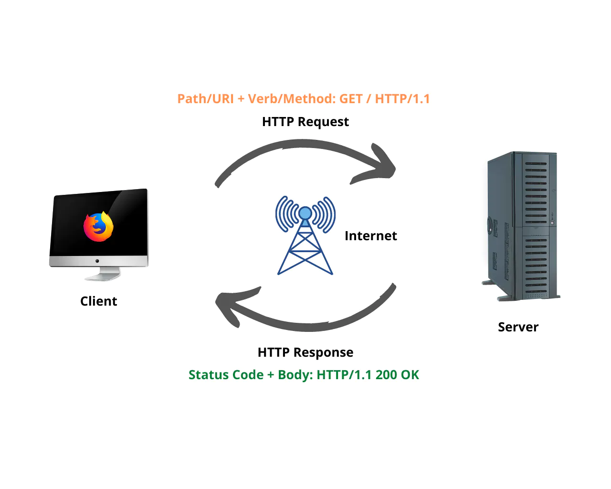

# Movies-Library
a movie app that can check the latest movies based on categoriest buildin with node.js [node.js](https://docs.npmjs.com/) and node express framework [exprese doc.](https://expressjs.com/)

**Author Name**: Abdelrahman Elatrash

## WRRC

## Overview
we  build a web application as a lebrary of movies classified by there categories
this part is show you a list of movies that we have with some description to let you choes what movies you want to show;

## Getting Started
this backend part of our project

install dependences
all dependences are in `package.json` file  
run this comand in home directory Movies-Library it will install all dependences for project
npm install

start the server run comand in the Movies-Library directory
npm start
or 
npm run devStart

## Project Features
the projec will run on the localhost with port 3000
[home page](http://localhost:3000/);

GET http://localhost:3000/ 
the server response with data
{"title":"Spider-Man: No Way Home","poster_path":"/1g0dhYtq4irTY1GPXvft6k4YLjm.jpg","overview":"Peter Parker is unmasked and no longer able to separate his normal life from the high-stakes of being a super-hero. When he asks for help from Doctor Strange the stakes become even more dangerous, forcing him to discover what it truly means to be Spider-Man."}

[favert page](http://localhost:3000/favorite)
GET http://localhost:3000/favorite

the server response with data

"Welcome to Favorite Page"

